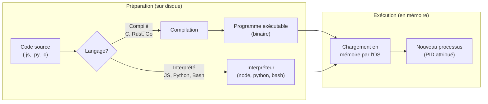
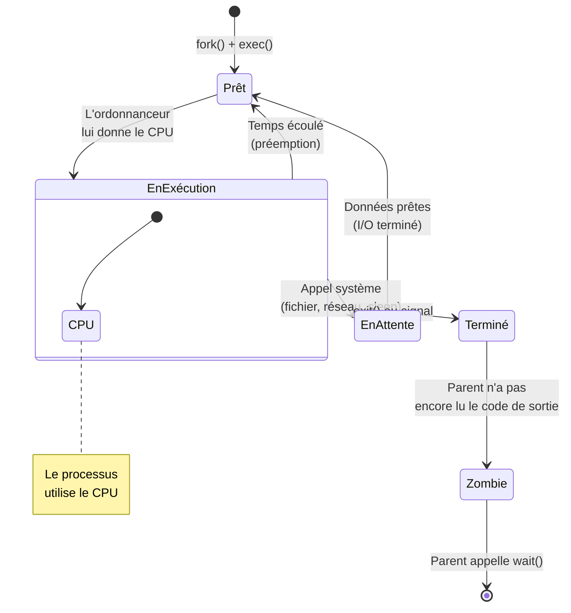

import { Aside, Steps, Tabs, TabItem, Card, CardGrid } from '@astrojs/starlight/components';
import ProcessResources from '../../../components/ProcessResources.astro';

<div style="font: 2em normal Lora, Merriweather, Georgia, Garamond, serif">
Que se passe-t-il quand tu lances réellement un programme?
</div>

## Programme vs processus

La distinction est fondamentale :

- Un **programme** est un fichier exécutable stocké sur le disque. 
C'est du code inerte : il ne fait rien tant qu'on ne le lance pas.  
**Exemples :** `/usr/bin/ls`, `/usr/bin/node`, `/usr/bin/nginx`.
- Un **processus** est une **instance en exécution** d'un programme.   
Quand tu tapes `node server.js`, le fichier programme `node` est chargé en mémoire et devient un processus vivant, avec son propre espace mémoire, ses variables d'environnement et un numéro d'identification unique.

On peut lancer **plusieurs processus** à partir du même programme.   
**Exemple:**
- Trois onglets de navigateur = Trois processus distincts issus du même programme Firefox. 
- Deux serveurs Node.js sur des ports différents = Deux processus à partir du même programme `node`.

### Identification : PID et PPID

Chaque processus reçoit un **PID** (*Process ID*) : un numéro unique attribué par le système au moment de sa création. Ce PID est la façon dont tu identifies et interagis avec un processus spécifique.

Chaque processus connaît aussi le PID de son **parent** : le processus qui l'a lancé. 
C'est le **PPID** (*Parent PID*). Cette relation parent-enfant crée un **arbre de processus** dont la racine est `systemd` (PID 1), 
le premier processus utilisateur lancé par le noyau lors du démarrage du système.

```bash
echo $$             # PID du shell courant
echo $PPID          # PID du parent de ce shell
pstree -p           # Affiche l'arbre de processus avec les PID
```

<Aside type="note" title="Que représente systemd">
`systemd` est le système d’initialisation et de gestion des services utilisé par la majorité des distributions Linux modernes. Son rôle principal est de :
- démarrer le système après le noyau Linux ;
- lancer et gérer les services et processus essentiels ;
- superviser l’état du système pendant son fonctionnement.
</Aside>

### Observer les processus

La commande `ps` (*process status*) affiche un instantané des processus en cours. 

```bash
# Lister tous les processus du système
ps aux

# Décoder les colonnes principales :
# USER   PID  %CPU %MEM    VSZ   RSS TTY  STAT START   TIME COMMAND
# www-data 1234  0.5  2.1 245000 42000 ?   Ss   09:15  0:03 nginx: worker process

# Surveillance en temps réel
top                      # Vue classique — appuie sur 'q' pour quitter
htop                     # Vue améliorée avec couleurs et interactions (à installer)
```

### Filtrer avec grep

Pour naviguer et filtrer l'ensemble des processus, on utilise en combinaison la commande `grep`, un outil fondamental qui **filtre les lignes** d'un texte en ne gardant que celles qui contiennent un motif donné.  
La syntaxe `commande | grep motif` utilise le **pipe** (`|`) pour envoyer la sortie d'une commande vers `grep`, 
qui ne laisse passer que les lignes correspondantes.

```bash
# Filtrer pour trouver un processus précis
ps aux | grep node
pgrep -l node           # Plus propre : affiche PID et nom
```


###  Cycle de vie : du code source au processus

Avant de devenir un processus, un programme passe par plusieurs étapes. Le chemin dépend du type de langage :
 


<Aside type="note" title="Compilé vs interprété">
En **C** ou **Rust**, le compilateur transforme le code source en un fichier binaire exécutable *avant* l'exécution. En **JavaScript** ou **Python**, le code source est lu et exécuté *au moment du lancement* par un interpréteur (`node`, `python`). Dans les deux cas, le résultat est le même : un processus en mémoire. Un script bash suit le même principe — `bash` est l'interpréteur.
</Aside>

### Les états d'un processus
 
Une fois créé, un processus ne tourne pas en continu sur le CPU. Il alterne entre plusieurs **états**, orchestré par l'**ordonnanceur** (*scheduler*) du système d'exploitation :
 

 
1. **Prêt** (*Ready*) — Le processus est en mémoire et attend que l'ordonnanceur lui attribue du temps CPU.
2. **En exécution** (*Running*) — Le processus utilise activement le CPU. Sur un processeur à 4 cœurs, au plus 4 processus peuvent être dans cet état simultanément.
3. **En attente** (*Sleeping/Blocked*) — Le processus attend une ressource externe : lecture d'un fichier sur le disque, réponse du réseau, entrée clavier. Il libère le CPU pendant ce temps.
4. **Terminé** (*Terminated*) — Le processus a fini son travail ou a reçu un signal d'arrêt.
5. **Zombie** — Le processus est terminé mais son parent n'a pas encore récupéré son code de sortie.
```bash
# La colonne STAT dans ps aux indique l'état :
# R — Running (en cours d'exécution)
# S — Sleeping (en attente)
# T — Stopped (suspendu)
# Z — Zombie (terminé mais pas encore nettoyé par son parent)
```
 
<Aside type="tip" title="Pertinence web">
Un serveur Node.js passe la **grande majorité** de son temps en état *Sleeping*: il attend des requêtes HTTP. 
Quand une requête arrive, il passe brièvement en *Running* pour la traiter, puis retourne en attente. 
C'est pourquoi un seul serveur Node.js peut gérer des milliers de connexions : il ne monopolise le CPU que pendant le traitement actif.
</Aside>

### Les ressources d'un processus
 
Quand un processus est créé, le système d'exploitation lui attribue un ensemble de **ressources** matérielles et logicielles. Comprendre lesquelles aide à diagnostiquer les problèmes de performance.

<ProcessResources pid="1234" processName="node server.js" />
 
| Ressource | Rôle dans le processus | Commande pour observer |
|---|---|---|
| **RAM** | Stocke le code en cours d'exécution, les variables, la pile d'appels | `ps aux` (colonnes `%MEM`, `RSS`) |
| **CPU** | Exécute les instructions du programme | `ps aux` (colonne `%CPU`), `top` |
| **Disque** | Fichiers lus et écrits par le processus | `lsof -p PID` (fichiers ouverts) |
| **Réseau** | Connexions réseau (sockets, ports) | `ss -tlnp` ou `netstat -tlnp` |
 
<Aside type="note" title="Équivalent Windows">
Le **Gestionnaire des tâches** de Windows affiche ces mêmes informations dans ses onglets *Processus* (CPU, mémoire) et *Performance* (vue globale). L'onglet *Détails* correspond à `ps aux`, et le *Moniteur de ressources* (`resmon`) offre une vue détaillée du disque et du réseau par processus — l'équivalent de `lsof` et `ss` combinés.
</Aside>
<Aside type="note" title="Processus zombie">
Un processus **zombie** (état `Z`) est un processus terminé dont le parent n'a pas encore récupéré le code de sortie. Ce n'est pas un processus actif — il ne consomme ni CPU ni mémoire — mais il occupe une entrée dans la table des processus. Quelques zombies sont normaux; des centaines indiquent un bug dans le programme parent.
</Aside>

### Signaux et terminaison
 
Les **signaux** sont le mécanisme de communication entre processus (ou entre toi et un processus). 

#### Quelques signaux importants
 
| Signal | Numéro | Effet |
|---|---|---|
| `SIGTERM` | 15 | Demande polie de terminer — le processus peut se nettoyer avant de quitter |
| `SIGKILL` | 9 | Arrêt **immédiat** et inconditionnel — le processus ne peut pas l'intercepter |
| `SIGINT` | 2 | Interruption — comme appuyer sur `Ctrl+C` |
| `SIGTSTP` | 20 | Suspension — met le processus en pause |
| `SIGHUP` | 1 | Signal de « raccrochage » — souvent utilisé pour recharger la configuration |
 
```bash
kill 1234           # Envoie SIGTERM au processus 1234 (arrêt propre)
kill -9 1234        # Envoie SIGKILL — arrêt forcé, à utiliser en dernier recours
kill -HUP 1234      # Envoie SIGHUP — recharge la config sans redémarrer
 
killall node        # Envoie SIGTERM à TOUS les processus nommés "node"
pkill -f "server.js"  # Tue les processus dont la ligne de commande contient "server.js"
```
 
<Aside type="caution" title="SIGTERM avant SIGKILL">
Utilise toujours `kill` (SIGTERM) **avant** `kill -9` (SIGKILL). SIGTERM laisse au processus le temps de fermer proprement ses connexions, écrire ses données en cours et libérer ses ressources. SIGKILL coupe tout brutalement — des fichiers temporaires peuvent rester, des données peuvent être corrompues.
</Aside>

{/* <Aside type="tip" title="Pertinence web">
Quand tu déploies une nouvelle version d'une application web, tu veux un **arrêt gracieux** (*graceful shutdown*). 
Le process manager (comme PM2 pour Node.js ou systemd) envoie d'abord SIGTERM au serveur, 
qui finit de traiter les requêtes en cours avant de s'arrêter. 

Puis la nouvelle version démarre. `SIGHUP` est souvent utilisé pour dire à Nginx de **recharger sa configuration** sans interrompre les connexions actives.
</Aside> */}
---
 
## Gestion de tâches
 
Jusqu'ici, chaque commande que tu lances dans le terminal bloque le prompt jusqu'à ce qu'elle se termine. C'est le comportement par défaut : la commande s'exécute au **premier plan** (*foreground*). Mais parfois, tu veux lancer une commande longue et continuer à travailler dans le même terminal.
 
### Premier plan et arrière-plan
 
#### Premier plan (par défaut)

Lorsqu'une tache s'exécute en premier plan, le terminal est bloqué pendant l'exécution.

```bash
node server.js
# Tu ne peux plus rien taper ici tant que le serveur tourne
```

#### Arrière-plan

Il faut simplement ajouter `&` à la fin de la commande

```bash
node server.js &
# [1] 5678 — le shell affiche le numéro de job [1] et le PID 5678
# Tu peux continuer à utiliser le terminal
```
 
### Suspendre, reprendre, basculer
 
```bash
# 1. Lance un processus au premier plan
node server.js
 
# 2. Suspends-le avec Ctrl+Z
# [1]+  Stopped                 node server.js
 
# 3. Reprends-le en arrière-plan
bg
# [1]+ node server.js &
 
# 4. Liste les tâches du shell
jobs
# [1]+  Running                 node server.js &
 
# 5. Ramène-le au premier plan
fg %1
# node server.js  (le terminal est de nouveau bloqué)
```
 
<Aside type="note" title="Job vs processus">
Un **job** est la notion de tâche *vue du shell*. Un **processus** est la notion *vue du système*. Le même programme en exécution est à la fois un job (avec un numéro `[1]`, `[2]`...) et un processus (avec un PID). La commande `jobs` montre les jobs de ton shell; `ps` montre tous les processus du système.
</Aside>
{/* ### Se détacher du terminal
 
Par défaut, quand tu fermes le terminal, tous les processus lancés depuis ce terminal reçoivent `SIGHUP` et se terminent. Pour qu'un processus survive à la fermeture du terminal :
 
```bash
# nohup — immunise le processus contre SIGHUP
nohup node server.js &
# La sortie est redirigée vers nohup.out
 
# disown — détache un job déjà en cours
node server.js &
disown %1
```
 
<Aside type="tip" title="Pertinence web">
En développement, tu lances souvent un serveur de développement (`npm run dev`) qui doit tourner en continu. Avec `&`, tu peux le lancer en arrière-plan et garder ton terminal libre pour d'autres commandes. En production, tu n'utiliseras pas `nohup` — tu utiliseras un **process manager** comme `systemd` ou `PM2` qui gère le redémarrage automatique, les logs et la surveillance.
</Aside> */}